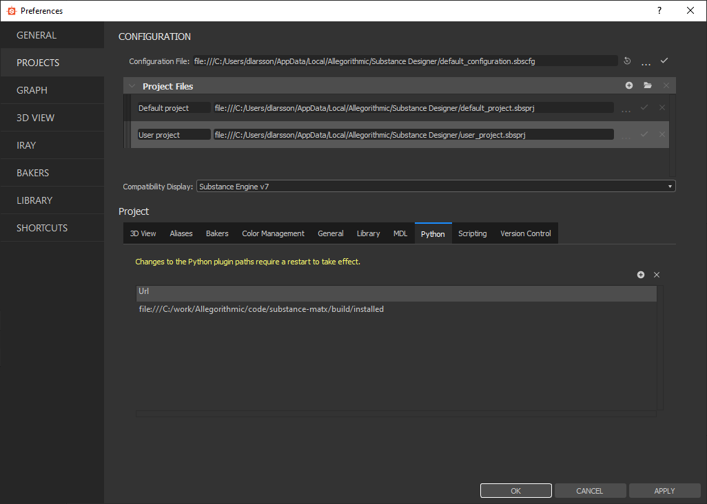
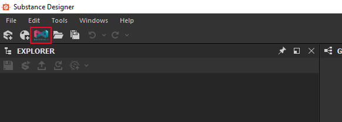
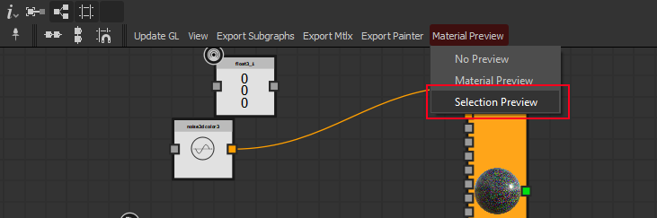

# Substance MaterialX plugin beta
MaterialX plugin for Substance Designer

## Overview
The Substance Designer MaterialX plugin allows creating MaterialX graphs from Substance
Designer.
This is an experimental plugin and it doesn't intend to support everything and
takes certain short cuts. This means you should be cautious using it in a production 
setting at this point. 

### Features
The plugin allows you to build MaterialX Graphs and export them.

* Building procedural shader graphs with shader bindings
* Binding textures directly from Substance designer so procedurals and textures can be designed together
* Visualizing results in GL and iRay viewports in Designer
* Generating Painter and Designer shaders that can be deployed independently of the plugin
* Matching Production/Game Engine shader features missing in Designer and Painter
* Exporting MaterialX documents with textures that can be used in other 
applications supporting MaterialX 

### Version History
[Version history](changelog.md)

### Known bugs and issues
[Known bugs](doc/known_issues.md)

### Shader feature limiatations
[Standard Surface Limitations](doc/standard_surface_compatibility.md)

### Rendering MaterialX Shaders in Arnold for Maya
[Arnold for Maya](doc/render_arnold.md)


### Links and references
* [MaterialX website](http://www.materialx.org/index.html)
* [MaterialX specification](http://www.materialx.org/Specification.html) This is the starting place for learning what 
the different nodes do
* [MaterialX Github page](https://github.com/materialx/MaterialX)
* SIGGRAPH Presentation on MaterialX [Video](https://vimeo.com/355165002), 
[Slides](http://www.materialx.org/assets/Sig2019_ADSK_MaterialX_Vision_Series.pdf)  
* [Standard Surface](https://autodesk.github.io/standard-surface/) Overview of the Autodesk Standard Surface which
is the main material model the MaterialX plugin uses at this point
 
## Installation
To install the plugin, copy the plugin directory to the ```sduserplugins``` directory. It's
typically located in ```c:\Users\<USERNAME>\Documents\Allegorithmic\Substance Designer\python\sduserplugins```
You can also place it in a custom location and add that directory to the python plugin paths. 
If you have an old version of the plugin installed, remove it before starting to avoid any old files causing
issues. The only thing you might want to preserve is data/config/sdmatxplugin-config.json if you have edited it.

In order for the plugin to work the directory it's installed in needs
to be writable from Substance designer

After installing the plugin you'll need to install the Python 3.7 version 
of MaterialX 1.37.2. Prebuilt packages for Windows
can be found from the [MaterialX Github](https://github.com/materialx/MaterialX/releases/download/v1.37.2/MaterialX_Windows_VS2017_x64_Python37.zip). 
Note that we strive to always support the latest master build but in 
general it's safer to use the specific link above to make sure no 
recently introduced change break things.

You can either put it at a location of your choice
and point the environment variable ```MATERIALX_ROOT``` to it or put the content of the
package in the directory ```MaterialX``` in the materialx designer plugin directory.
[If working on Linux/Mac you need to build your own MaterialX package](doc/build_cmake.md)

When the plugin is installed with MaterialX, open Substance Designer and
make sure the plugin location is set as a python plug-in directory. Note, 
the plugin directory should be a descendant of the plugin directory you add as opposed to
adding the directory with the plugin directly.



After changing the path, restart Designer for the update
to be acknowledged. 

When the plugin is properly installed the directory layout should look like this (contents of deeper directories 
cropped out):
```
sdmatxplugin
    ├── MaterialX
    │   ├── bin
    │   ├── cmake
    │   ├── include
    │   ├── lib
    │   ├── libraries
    │   ├── python
    │   └── resources
    ├── data
    ├── doc
    └── python
```

In case of a successful plugin installation a new toolbar button will show
up looking like this:



### Samples
The samples can be found in ```sdmatxplugin/data/samples```

* [Floor](doc/samples/Floor/floor.md)
* [Painter](doc/samples/Painter/painter.md)

## Getting Started
### Creating a graph
Create a MaterialX Graph using the toolbar button
This will put you in a special version of the MDL editor where all the
nodes are from MaterialX standard library with the exception of some helper
nodes we'll explain below.
#### The basics
The first node you want to adding an ubershader. The main supported
one today is standard surface. Press tab, search for _standard_surface_, create
it and then set it as root by right clicking on it and selecting that option 
from the menu. The standard surface material model is extensive, the implementation
in the Substance Designer plugin is somewhat limited, the details are here,
[Standard Surface Limitations](doc/standard_surface_compatibility.md)


Now, make sure your viewport is set to __iRay__.
Right click on the graph in the designer explorer or in the back of the 
graph editor and select __Set as Material Definition in 3D View__.
If everything is working you should have a plain white object in the viewport

You can tweak the parameters but to see something more exciting you can 
create a noise node called _noise_3d_color3_ and connect it to the base 
color. This will now show you a procedurally generated pattern on your node

From here you can experiment with nodes. Everything available in the graph
are MaterialX Nodes.

#### Exposing parameters
Exposing parameters works like in the ordinary mdl editor. You create a 
constant and select exposed on it.
This means they can be tweaked externally and will end up in the public 
interface if the material you are working on.

#### Tweaking parameters
In order to get a consistent behavior between the iRay and GL viewport the
recommended place to tweak parameters is from the MaterialX graph properties.
Double click in the background of the graph editor or select the graph in the 
explorer to get to it.

#### Textures
To bind textures to a graph in a way that is compatible with both GL and iRay,
Expose a usage with the _Sampler Usage_ set on it. Note that other ways of binding
textures such as referencing resources and directly introducing comp graphs into
the MaterialX graph are _not_ supported and may give undefined behavior at this point.
 
If creating a color constant, expose it 
and set its _Sampler Usage_ as baseColor it will be exposed as a texture input 
rather than a color.

In order to bind a texture to it in designer, create a comp graph with a 
baseColor output right click on it and select _View Outputs in 3d view_ or 
drag it to the viewport you are working in. Note that in the case of an 
exposed color the UV used is always UV 0 which is often what you want.

Another thing to note here is if binding textures from an sbsar file (as opposed)
to an sbs file you need to import it into a compositing graph and connect the outputs to
the outputs. It's unfortunately not possible to render the textures directly from the
sbsar file in Designer.

In case you want to take control of the UV generation yourself, create a
_texture_2d_ node and expose it instead. In order to sample from it you can
use the _image_ family of nodes. They have a UV input so you can tile or 
select different sources of UV's.

#### Notes on texturing
In general you want to sample color textures using _sRGB_ as _Gamma Type_ and
all other textures as _Gamma Linear_. For the GL Viewport gamma type is only active
on Color textures. For vector and float types they will always be considered linear
regardless of what the setting says.

#### Normal maps
There is a default behavior for converting directly exposed _float3_ as 
normal maps to world space which is inconsistent between the GLSL viewport and
the iRay viewport.

For normal maps, please use

* Explicit sampling using a _texture_2d_   
* Use _image_vector3_ for getting the value
* Use _Gamma Linear_
* Use the node _algnormalTStoWS_ to do an explicit tangent space to world space
conversion before feeding it into the normal input of the shader.

### The GL viewport
The MaterialX plugin can visualize shaders in the GL viewport in addition
to the iRay one. In order to set it up, start by switching to the GL viewport.

When using the _standard_surface_ shader it will generate a glslfx file in 
```<pluginroot>/data/shaders/standard_surface_generated.glslfx``` which is 
incrementally exported as you edit your shader.

Load this file (unfortunately there is not a script api call for doing
this meaning you'll have to do it manually for now). If it succeeds it should
show the shader, potentially with incorrect textures. Drag the comp graph 
you want to bind textures from into the viewport and you should have OpenGL
preview of your shader.

#### Debug mode
When using the OpenGL viewport there is a debug mode allowing you to 
visualize the currently selected node instead of the root node. It's available
in the MaterialX editor toolbar (note, this doesn't work when using iRay).



#### Swizzling
Swizzle patterns are described as a string and supports rgba/xyzw. To 
duplicate _x_ 3 times in a 3 vector, input the string _xxx_
#### Types
Types map generally between MDL and MaterialX but there are some 
differences

* Vector types in MDL (float2, float3, float4) are called vector2, vector3, 
vector4 in designer. When creating a constant of float3 it maps directly to a
a MaterialX vector3 etc.
* The MDL color type maps to color3 in MaterialX

Currently there has been no ambition to try to map all MDL types accurately to 
MaterialX but only support what is needed to get the
standard library working 

### Painter Export
When pressing the _Export Painter_ button a glsl file compatible with Painter
in generated the <Userdocs>/Allegorithmic/Substance Designer/sdmatx/painter
Note that usages known in painter will be exported as paintable channels
all other inputs with usages will be considered textures on shader level. This means you
should not do anything to the UV's on texture inputs that are paintable or things 
will behave very strangely in Painter. Currently the only supported ubershader for painter
is standard surface. It's also a very limited implementation. An additional issue 
is there are some
short cuts in how the texture sets are being sampled causing occasional flicker in
the viewport.
#### Usage mappings
The known usages in designer that are mapped to the appropriate texture sets are:
```
_usage_mapping = {
    'ambientOcclusion': 'channel_ambientocclusion',
    'anisotropyAngle': 'channel_anisotropyangle',
    'anisotropyLevel': 'channel_anisotropylevel',
    'baseColor': 'channel_basecolor',
    'blendingmask': 'channel_blendingmask',
    'diffuse': 'channel_diffuse',
    'displacement': 'channel_displacement',
    'emissive': 'channel_emissive',
    'glossiness': 'channel_glossiness',
    'height': 'channel_height',
    'IOR': 'channel_ior',
    'metallic': 'channel_metallic',
    'normal': 'channel_normal',
    'opacity': 'channel_opacity',
    'reflection': 'channel_reflection',
    'roughness': 'channel_roughness',
    'scattering': 'channel_scattering',
    'specular': 'channel_specular',
    'specularLevel': 'channel_specularLevel',
    'transmissive': 'channel_transmissive',
    'user0': 'channel_user0',
    'user1': 'channel_user1',
    'user2': 'channel_user2',
    'user3': 'channel_user3',
    'user4': 'channel_user4',
    'user5': 'channel_user5',
    'user6': 'channel_user6',
    'user7': 'channel_user7',
    'texture_ambientocclusion' : 'texture_ambientocclusion',
    'texture_curvature':'texture_curvature',
    'texture_id':'texture_id',
    'texture_normal':'texture_normal',
    'texture_normal_ws':'texture_normal_ws',
    'texture_position':'texture_position',
    'texture_thickness':'texture_thickness'
}
```
The usages prefixed texture_ are referring to baked mesh maps.

In order to use the shader in painter, import the generated glsl file to your project
and set it as the active shader in the project.

### MaterialX Export
Exports the graph as a MaterialX, optionally with all dependencies and resources.

### MaterialX View
Opens up MaterialXView with the current Graph. Note, you need to explicitly select what
graph to export textures from.

### Subgraphs
Subgraphs is an experimental feature.

It allows creating functions to be used in other graphs. All subgraphs are namespaced
based on the substance file it's located in so multiple graphs in the same document can be
exported together.

To create a subgraph:

* Create a new Substance Document with an MaterialX graph in
* Name the graph to the name you want to refer to it by
* Create inputs like in an ordinary graph and wire up the function
* Create a node of the type subgraph_output and connect the result of the function to it
* Press the Export Subgraphs button in the toolbar

When doing this, the subgraphs in the document will be exported to the directories 
```<Userdocs>/Allegorithmic/Substance Designer/sdmatx/mtlx``` and 
```<Userdocs>/Allegorithmic/Substance Designer/sdmatx/mdl``` for the MaterialX definition
and mdl definitions respectively. Substance Designer doesn't allow reloading MDL defintions
so you need to restart designer when re-exporting a subgraph. The one exception to this
rule is if you are only interested in the MaterialX/GLSL version where you can skip the 
restart assuming:

* The interface (inputs, parameters, outputs) has not changed
* It's a graph that was exported with the same interface before starting designer 

## Advanced Notes
These are features that are not fully supported but mentioned here for advanced users
that are not afraid of experimenting with the Python scripts directly. Get in touch
with us in case you run into any issues doing these things and we'd be happy to help
out getting things right.
### Importing own MaterialX libraries
If you have your own set of MaterialX nodes you want to use inside of the Designer 
MaterialX editor you need to make sure they are found by designer and properly converted
to MDL definitions. The MDL conversion is still limited and it only supports single
return value functions and a limited set of types.
The key things to get this right is:

* Make sure the path is in the MaterialX search paths ```sdmatxplugin/python/sdmatx/paths.py```
* Make sure it's listed as a module to build on startup ```sdmatxplugin/__init__.py```
* You need to clean the preexisting mdl files in ```sdmatxplugin/data/mdl/matx``` 
except utilities.mdl (which is handwritten) to trigger a rebuilding the libraries next
time Designer is restarted.

### Adding support for Ubershaders
The MaterialX graph can support multiple ubershaders but at the moment the only 
properly implemented one is standard surface from Autodesk.
In order to add support for your own Ubershader you need to produce a GLSLFX template
and a GLSL root shader.
Let's say you are looking to create a shader with a node type called  ```my_shader```.
First it needs to be created as a shader in MaterialX and imported as described in the
previous topic so it's available from designer.  
#### Designer
You need create the following files:

* __sdmatxplugin/data/shaders/my_shader_template.glslfx__
* __sdmatxplugin/data/shaders/my_shader/fs_modular.glsl__ (or whatever glsl file you reference from the template)

When the code generation hits the shader it will look up the template named <shader>_template
and add any exposed parameters to it.

It will also generate a file caled ```sdmatxplugin/data/shaders/my_shader/matx.glsl```
which contains the entry point called ```matx_compute``` for generating all the 
inputs for the ubershader. Its interface is defined by the node def in MaterialX.
  
In order to use the generated function, include it in the fs_modular.glsl and call it
from the main function and use the generated values to drive your lighting calculations.
The best starting point is looking at the standard_surface implementation inside of
the plugin.

For more information on the Designer Shader API, check out:
[Designer Shader API](https://docs.substance3d.com/sddoc/glslfx-shaders-102400055.html)
#### Painter
Substance Painter has a different way of implementing GLSL shaders and the mechanism is
putting a template file inside of ```sdmatxplugin/data/painter/my_shader_template.glsl```
In the painter case most of the code is generated for you including the outputs of the
procedural part of the shader. The contents of the template file will be glued in
for you in the generated shader. Your job is to use these values and drive the shading 
from this. The easiest way to get this right is looking at what happens with the 
standard_surface shader that comes with the plugin. 

For more information on the Painter Shader API, check out: 
[Painter Shader API](https://docs.substance3d.com/spdoc/custom-shader-api-89686018.html) 


### Coordinate systems
Different applications and applications uses different coordinate systems.
For the provided material ball model as of 0.1.3, the object space should align
with the object space for the same model in Substance Designer. 
#### Substance Designer
Substance Designer supports world and object space coordinates for positions/normals
The object space is the untransformed mesh as it is in the scene graph, the 
world is the transformed mesh
#### Substance Painter
Substance Painter has no notion of object space so it uses the same 
coordinate system for World and Object space and  it's what maps to the Designer 
world coordinate system.
#### MaterialX View
MaterialX view uses OBJ files which has no notion of transform. The Object space
is defined as the coordinate system in the mesh, world space is sometimes different
since the user can transform the object in various ways.

#### Recommendations

* When authoring individual assets build your procedurals for object
space since it will make the procedural stable to transformations (i.e rotating
or translating the object will not affect the procedural).
* When working with different applications, use a mesh where you bake any 
transformations into the model before starting to work. This means it will come
out aligned in different applications. If you have a transformation hierarchy on
the model (and use a format supporting it) your object space will be misaligned
if previewing an OBJ export of it in the MaterialX Viewer or you import it in 
Painter 
