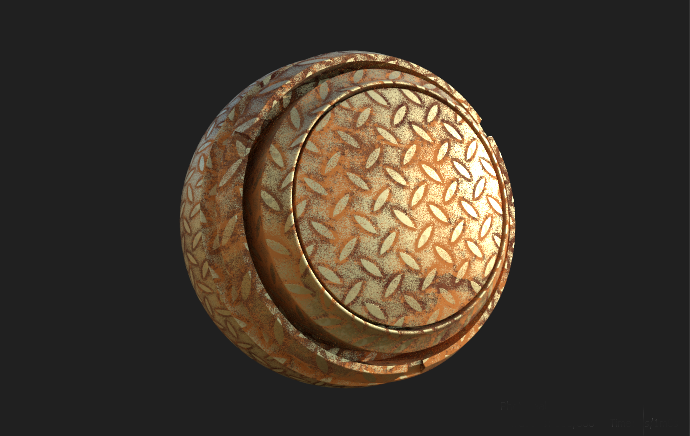
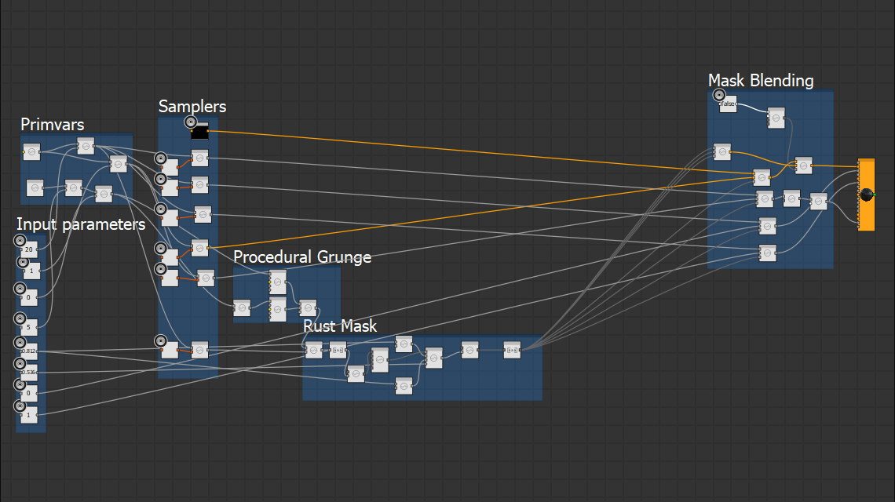
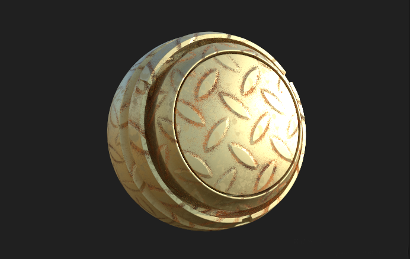
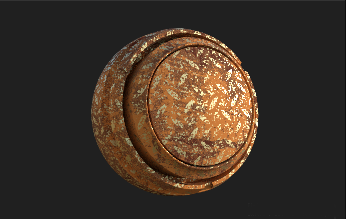

# Floor Sample

The floor sample is a graph that mixes procedural textures and procedural shading in order to add rust to a surface
based on shader parameters.

## Features Shown

* Procedural world space noise for micro details in masking
* Managing different textures at different resolution and tilings to save texture usage
* Procedural mask generation
* Texture binding

## The textures
The sample is located in data/substances in the plugin directory. It contains two graphs, the MaterialX
graph called Shader and the procedural texture graph called Floor.

The textures produced are by the Floor Graph

* **basecolor** the base color map for the floor
* **normal** the normal map for the floor
* **roughness** the roughness map for the floor
* **metallic** the metallic map for the floor
* **Rust_Basecolor** The basecolor for the rust map
* **Rust_Normal** The normal for the rust map
* **Floor_AO** The ambient occlusion map used to drive rust. This one is tiled like the normal map and controls areas 
where more or less rust should show up

The first thing to note is how **normal** and **floor_AO** are lower resolution textures that can be tiled independently
of the rest of the textures meant for a repetitive pattern. The two rust maps are also tiled individually to make it
possible to have more high frequency details in the rust.

## The Shader

The shader is built in the following parts:

* **Input Parameters** Different parameters allowing the shader to change appearance
* **Primvars** This is where positions and UVs are looked up and scaled for usage by different samplers/procedurals
* **Samplers** Texture samplers fetching texture data from the Floor comp graph
* **Procedural Grunge** Noises for producing world space perturbations when generating the mask for where the rust is
* **Rust Mask** Where the procedural grunge, texture data and parameters are used to compute a rust mask
* **Mask Blending** The textures are mixed with based on the rust mask

### The parameters

* **rust_roughness** Global roughness value for rusty parts
* **rust_metallic** Global metallic for the rusty parts
* **rust_pow** Controls the sharpness of the border between rusty and non-rusty part
* **rust_factor** Sets the amount to rust to have on the object
* **grunge_scale** Controls the scale of the grunge modulated into the rust mask
* **grunge_offset** Offsets the grunge in the rust
* **rust_tiling** Tiles the Rust_basecolor texture for more or less texture detail/tiling in the rust
* **pattern_tiling** Tiles the normal map (and the ao map) over the object
* **visualize_mask** Debug setting to visualize the rust mask in the basecolor

Tweaking parameters on the shader only we can create multiple different looks

